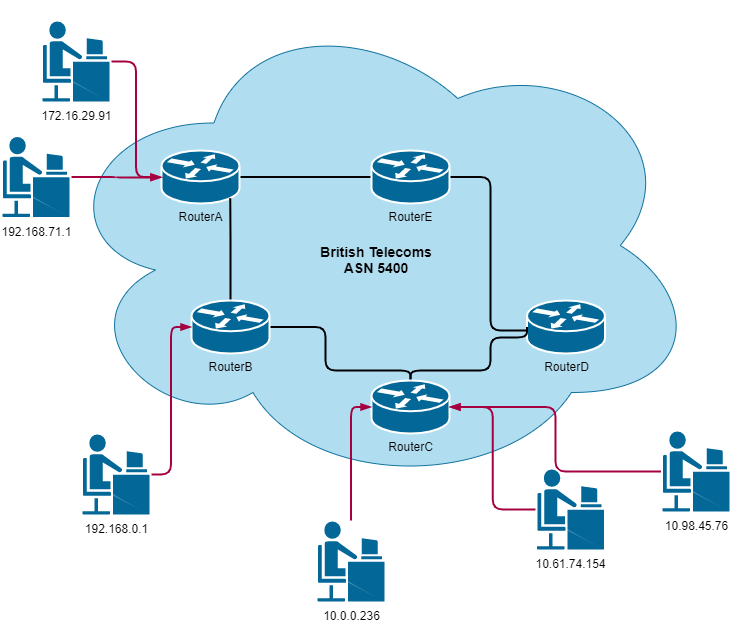
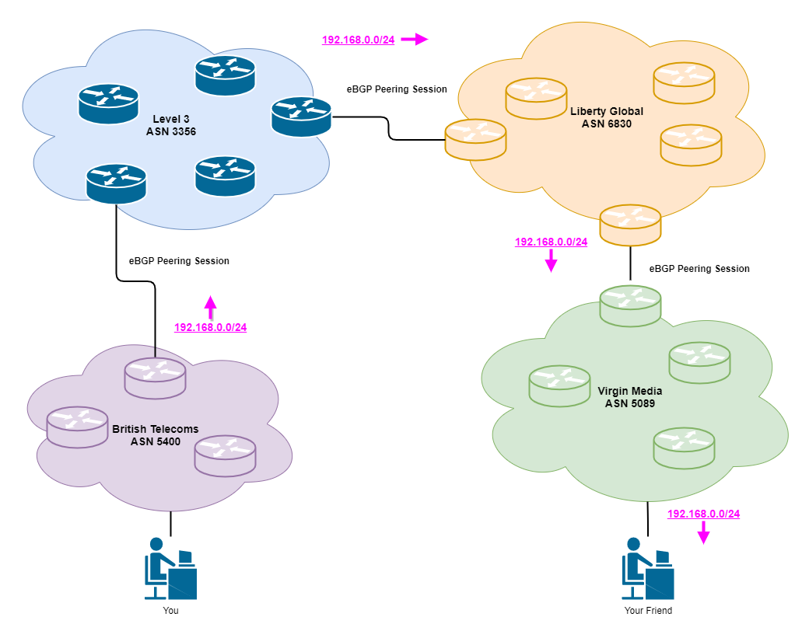

## IP Addressing and the Internet 
When you buy internet from an Internet Service Provider (ISP), they send you a router and plug that into the wall, boom, you’re now on the internet. Underneath the hood, a lot of parts come together to enable that. When you plug into the service provider network, they will dynamically assign you an IP address. This is your internet identifier, anyone wants to speak to you, they use this, but, how do you know where anything is? all you did was plug in a cable, how does that magically give you access to everything? How do you speak to Netflix? Amazon?
 
## Routing Protocols
To deal with the IP protocol and ensuring all connected devices know where to send their packets, we have routing protocols. There are different types of routing protocols for different purposes. Interior Gateway Protocols (IGPs) such as (OSPF, ISIS, RIP) are used for when you are routing packets in a domain that you own, for example, an office would run an IGP for their network. Exterior Gateway Protocols (EGPs) such as (BGP) is used when networking domains, owned by different organisations, want to speak to each other.
What that looks like on a router is, something like this…
 
```cisco
R2#show ip route
Codes:
C – connected, S – static, I – IGRP, R – RIP, M – mobile, B – BGP
D – EIGRP, EX – EIGRP external, O – OSPF, IA – OSPF inter area
N1 – OSPF NSSA external type 1, N2 – OSPF NSSA external type 2
E1 – OSPF external type 1, E2 – OSPF external type 2, E – EGP
i – IS-IS, L1 – IS-IS level-1, L2 – IS-IS level-2, ia – IS-IS inter area
* – candidate default, U – per-user static route, o – ODR   P – periodic downloaded static route Gateway of last resort is not set.
C 192.168.1.0/24 is directly connected, Serial0/0/0
C 192.168.2.0/24 is directly connected, Serial0/1/0
O 192.168.3.0/24 [120/1] via 192.168.1.1, 00:00:18, Serial0/0/0
O 192.168.4.0/24 [120/2] via 192.168.1.1, 00:00:18, Serial0/0/0
```
[Sourced from networkstraining.com](https://www.networkstraining.com/cisco-show-ip-route-command/)
 
Take the top line, for example, this cisco router has a route for “192.168.3.0/24” via 192.168.1.1 which is out of this routers Serial0/0/0 port. This router has got this route via OSPF (Look at the codes and the start of the line). We can infer from this that there is another router on the other end of the Serial0/0/0 port, with an IP address of 192.168.1.1 that is running OSPF, and that router advertised to our router, it knows how to get to 192.168.3.0/24.

British Telecoms (BT) is a big Internet Service Provider (ISP) in the UK, they have a lot of customers connecting to their network, if those customers want to communicate, BT will use an IGP to facilitate this. Take this diagram as an example.
 

 
2 Customers link into RouterA, RouterA knows about the customers and the routers directly connected, but not anything directly connected to them (ie customer 10.0.0.236, 192.168.0.1 etc.). RoutersA-E will share information about customers connected to them via an IGP, for example, RouterA would tell RouterB and RouterE it knows how to get to 17.16.29.91 and 192.168.71.1. RouterE and RouterB would then tell their adjacent routers (RouterD and RouterC).
 
## Routing Protocols on the Internet
So we’ve now got a working ISP, and the customers can speak to each other. What if a BT customer wants to speak to a Virgin Media customer? With 4,294,967,296 possible IPv4 addresses, would it be scalable to have every router know about every customer ever? Is there a way we can aggregate these customers? This is where BGP comes in.
 
### Regional Internet Registries
Regional Internet Registries (RIRs) are the organisations that handle who owns which IP address and other internet identifiers. The internet isn’t centralised therefore without RIRs anyone could claim any IP range. If I want to buy some IPv4 space, I need to buy that off a RIR and they will then update their database saying I own X IP range. There are 5 RIRs, each controlling different regions. [Info](https://en.wikipedia.org/wiki/Regional_Internet_registry)
 
### Autonomous Systems
When an internet service provider is speaking to multiple other service providers, they use something called an autonomous system number (ASN). This is because different service providers don’t want to use names to track who they’re speaking to, it’s a lot easier to use a simple number. Service Providers will go to their Regional Internet Registry and buy a number, for example, BT has the number 5400. Whenever routers speak between service providers, they use this number to identify who administers them.
 
### Worked Example
BT has registered the IP range 192.168.0.0/24 with RIPE (A Regional Internet Registry) and they now own that range, they already have the ASN 5400. RIPE’s job isn’t to let other people know BT owns that range now, they just keep track, it’s down to BT to let people know they own this new IP range. So they have to advertise to other ISPs, if they want to send traffic to anyone in the range 192.168.0.0/24, they have to send it to BT. BT will ring up their “peers” (Other service providers) and ask if any of them would like to be BGP neighbours. BT being quite large will peer with a lot of other service providers and once they have a cable from a BT router to another service provider router. They establish a BGP peering relationship, allowing them to advertise IP addresses they own, alongside their ASN number.
 

 
 
## What Does This Look Like?
### RouteViews Data
The University of Oregon has created a non-profit project called RouteViews. They have called different service providers and asked them to advertise their routes via BGP to what the university of Oregon calls Route Collectors. These are stationed across the globe to collect all the BGP information in the global routing table. More Information [here](http://www.routeviews.org/routeviews/). You can do this yourself by telnet’ing into a collector and writing the command “show bgp ipv4”. [List of collectors](http://www.routeviews.org/routeviews/index.php/collectors/)
 
## The Global Routing Database
I Telnet'd to the route collector in AMS-IX and just dumped a bit of the table to show you what it looks like.
```
route-views.amsix.routeviews.org> show bgp ipv4
BGP table version is 80133497, local router ID is 80.249.214.5, vrf id 0
Default local pref 100, local AS 6447
Status codes:  s suppressed, d damped, h history, * valid, > best, = multipath,
               i internal, r RIB-failure, S Stale, R Removed
Nexthop codes: @NNN nexthop's vrf id, < announce-nh-self
Origin codes:  i - IGP, e - EGP, ? - incomplete
*  1.0.0.0/24       80.249.213.223        2000             0 267613 13335 i
*                   80.249.208.203                         0 20953 174 13335 i
*                   80.249.211.157                         0 57695 13335 i
*                   80.249.211.140                         0 1140 13335 i
*                   80.249.208.126                         0 24875 13335 i
*                   80.249.208.152                         0 39591 13335 i
*                   80.249.211.140                         0 31019 13335 ?
*                   80.249.208.35            0             0 12859 13335 i
*                   80.249.211.140                         0 1103 13335 i
*>                  80.249.211.140                         0 61955 13335 i
*                   80.249.210.28                          0 39120 13335 i
*                   80.249.211.140                         0 1103 13335 i
*                   80.249.210.99                          0 50763 13335 i
*                   80.249.211.140           0             0 12779 13335 i
*                   80.249.213.7             1             0 293 2914 13335 i
*                   80.249.210.29                          0 5394 13335 i
*                   80.249.212.104                         0 58511 13335 i
*                   80.249.211.140                         0 34968 13335 i
*                   80.249.211.140                         0 51088 13335 i
*                   80.249.208.106                         0 6830 6453 13335 i
*  1.0.4.0/22       80.249.213.223        2000             0 267613 6939 4826 38803 56203 i
*                   80.249.209.150                         0 61955 6939 4826 38803 56203 i
*                   80.249.211.157           0             0 57695 6939 4826 38803 56203 i
*                   80.249.208.152                         0 39591 6939 4826 38803 56203 i
*                   80.249.208.72                          0 20953 15412 4826 38803 56203 i
*                   80.249.209.150           0             0 12779 6939 4826 38803 56203 i
*                   80.249.212.104                         0 58511 6939 4826 38803 56203 i
*                   80.249.209.150                         0 31019 6939 4826 38803 56203 ?
*                   80.249.208.35            5             0 12859 6939 4826 38803 56203 i
*                   80.249.208.72                          0 1103 15412 4826 38803 56203 i
```
With BGP RIB data you read it backwards, for example for the range "1.0.0.0/24", the owning/advertising ASN is 13335. ASN 13335 then advertises out to the ASN to the left of its own 
```
*  1.0.0.0/24       80.249.213.223        2000             0 267613 13335 i
*                   80.249.208.203                         0 20953 174 13335 i
*                   80.249.211.157                         0 57695 13335 i
```
Here, ASN 13335 is advertising the range 1.0.0.0/24 to:
ASN 267613
ASN 174, ASN 174 then advertises it on to ASN 20953
ASN 57695
 
## Picking The Best Path
With the internet being as huge as it is, how does the path to an IP range get picked. There are a few factors all documented [here](https://www.cisco.com/c/en/us/support/docs/ip/border-gateway-protocol-bgp/13753-25.htmlc) but if no properties have been set on the device, it will usually be the path of least hops. This will be the route with the least ASNs in it. 
If an ISP gets the same route from loads of different providers, these will all be kept in the router's RIB (Routing Information Base), it will run the best path selection algorithm on the RIB for each range, and install the best next-hop IP address in the FIB (Forwarding Information Base), the FIB is kept in hardware to ensure quick packet switching and will not change unless the RIB is recalculated with a different result.
 
## Conclusion
BGP is a great protocol and is the backbone of the internet. The problem with BGP is it is a lazy routing protocol, there are no error checks or even validation checks which leads to huge security problems on a global scale. I’ll look into these in later posts.