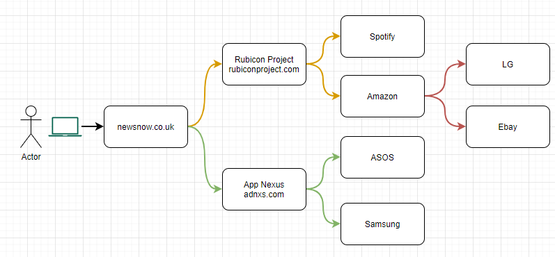
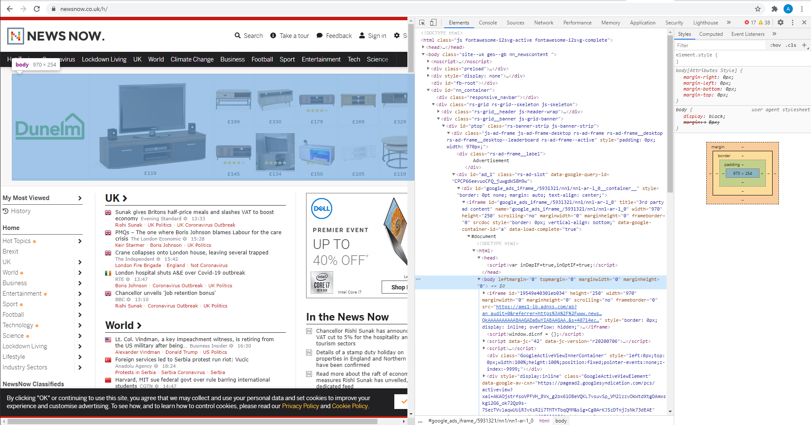

## Introduction
During my time working from home, I was browing [Hacker News](https://news.ycombinator.com/), it's a great site that has some great information on it if you can get over the hideous UI. I stumbled on something called 'Malvertising', the post I came across is a few months old and I have only just got around to doing a writeup, so I've since lost it. You can read about it here though [https://blog.eccouncil.org/malvertising-what-it-is-and-how-to-avoid-it/](https://blog.eccouncil.org/malvertising-what-it-is-and-how-to-avoid-it/). 

Reading this sparked my interest, who was serving the biggest Ad Exchanges on the internet? We know about Google and Facebook, but who are the other players?

So I began to dig into the world of Real Time Bidding and how it works. If you just google the phrase 'Real Time Bidding' you'll come across a lot of posts, there is a nice wiki page though [Wiki](https://en.wikipedia.org/wiki/Real-time_bidding). 

The 101 to Advertising data is this. There are things called Advertising Exchanges, websites that put advertising on their page, will use an advertising exchange to serve these adverts. When you sign up to google advertising on your website, you embeed a bit of googles code that decides what advert to serve to the user when they visit the site. When a user visits the site and this little bit of google code executes, it asks all of its 'buyers' who wants to serve the advert, a buyer can be any company that want's to serve ads to people, Spotify, Levis, Amazon etc. 
Here is a digram of that happening: 

In this example, I visited 'newsnow.co.uk', this is just a news aggregator. Newsnow have signed up to serve adverts via two Advertising Exchanges, Rubicon and AppNexus. When I go to that site, AppNexus and Rubicon javascript executs to tell their buyers, someone is ready to serve to be served an advert. In this case, Rubicon tell Spotify and Amazon. Spotify and Amazon then decide if they want to serve this user an advert (based on cookies, location or other user data) or, in Amazons case here, it could not decide to serve and advert but ask some other buyers if they would like too. *This probably wouldn't happen with these companies because of size but the point here is it's hierarchical.*

So let's see what that looks like visually - here is me opening the webpage and seeing the element that is serving the advert.

On the left, the highlighted part is the element I'm currently hovering over. On the right is the iFrame (Javascript Code) used to speak to Adnxs (AppNexus) in this instance.

